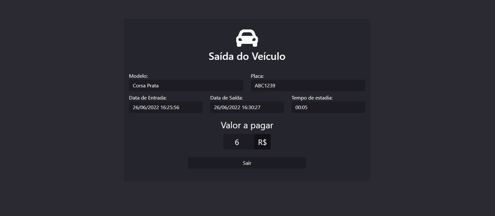

<h1 align="center">Avaliacao_JAVA</h1>


<h4 align="center"> 
  Desenvolver um simples sistema de estacionamento utilizando Java
</h4>


<h4 align="center"> 
  🔹 Status: Concluído ✅
</h4>

## Caminhos

#### Retorna a tela de login

```http
  GET localhost:8080/
```

#### Verifica de usuário e senha é válido se válido loga

```http
  POST localhost:8080/
```

#### Retorna a tela de lista de veículos estacionados

```http
  GET localhost:8080/{id}/lista
```

#### Retorna a tela de lista de veículos que já sairam do estacionamento
```http
  GET localhost:8080/{id}/lista/sairam
```

#### Retorna a tela do formulário de cadastro de veículos
```http
  GET localhost:8080/movimentacao/{id}"
```
#### Faz a requisição para salvar o formulário de cadastro de veículos
```http
  POST localhost:8080/movimentacao/add"
```

#### Retorna a tela do formulário de edição de veículos
```http
  GET localhost:8080/movimentacao/editar/{id}"
```
#### Faz a requisição para salvar a edição formulário de edição de veículos
```http
  POST localhost:8080/movimentacao/editar/{id}"
```

#### Retorna a tela do formulário de saída de veículos
```http
  GET localhost:8080/movimentacao/saida/{id}"
```
#### Faz a requisição para salvar o formulário de saída de veículos
```http
  POST localhost:8080/movimentacao/saida/{id}"
```
## Demonstração


Tela de Login         |  Tela de Lista de Veículos Estacionados
:-------------------------:|:-------------------------:
  |  


Tela de Cadastro de Veículos        |  Tela de Edição de Veículos
:-------------------------:|:-------------------------:
 |  

Tela de Saída de Veículos       |  Tela de Lista de Veículos que Já Saíram
:-------------------------:|:-------------------------:
 |  

## Autor

- [@Pedro Teodorio](https://www.github.com/Pedro-Teodorio)


