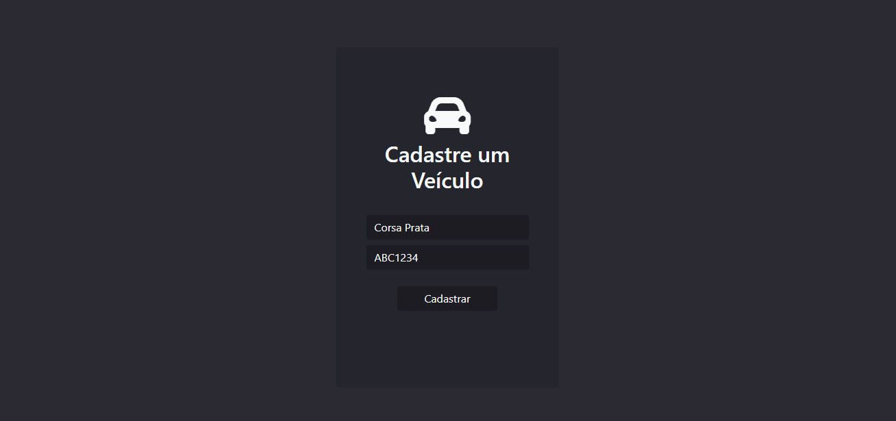
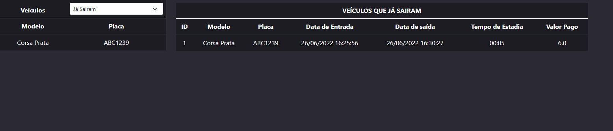

<h1 align="center">Avaliacao_JAVA</h1>

<h4 align="center"> 
  🔹 Status: Concluído ✅
</h4>

      <h4>Tela de Login</h4>
     

     <h4>Tela de Lista de Veículos Estacionados</h4>
     

     <h4>Tela de Cadastro de Veículos</h4>
     

     <h4>Tela de Edição de Veículos</h4>
     

     <h4>Tela de Cadastro de Veículos</h4>
     

     <h4>Tela de Cadastro de Veículos</h4>
     

     

